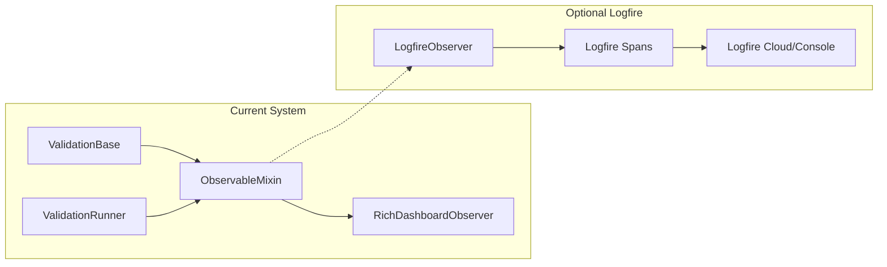

# Pydantic Logfire Research: Feasibility for abstract-validation-base

## Executive Summary

Pydantic Logfire is a promising observability platform that could enhance or partially replace the current tracking system. However, there are important trade-offs to consider around local usage, data ownership, and the specific needs of this validation library.

---

## What is Pydantic Logfire?

Logfire is an observability platform built by the Pydantic team, designed for Python applications. Key characteristics:

- **Built on OpenTelemetry**: Uses open standards for traces, logs, and metrics
- **Automatic Pydantic instrumentation**: One-line integration with `logfire.instrument_pydantic()`
- **Structured logging**: Native support for logging Pydantic models
- **SQL query interface**: Query your observability data using SQL

---

## Deployment Options

| Mode | Description | Cost | Data Location |

|------|-------------|------|---------------|

| **Cloud (Free Tier)** | Data sent to Pydantic's servers | Free with limits | Pydantic-hosted |

| **Cloud (Paid)** | Higher limits, more features | Paid | Pydantic-hosted |

| **Self-Hosted** | Run on your infrastructure | Enterprise pricing | Your infrastructure |

| **Console-Only** | Local development mode, no cloud | Free | Local terminal only |

**Local Development**: Logfire can run in console-only mode using:

```python
logfire.configure(send_to_logfire=False, console=True)
```

This outputs traces/logs to the terminal without sending data to any backend.

---

## Current Tracking System in abstract-validation-base

The project currently has a well-designed custom tracking system:

### 1. Process Log ([`process_log.py`](src/abstract_validation_base/process_log.py))

- `ProcessEntry`: Individual cleaning/error entries with timestamps, field names, values
- `ProcessLog`: Aggregates cleaning operations and errors per model

### 2. Event System ([`events.py`](src/abstract_validation_base/events.py))

- `ValidationEventType`: ERROR_ADDED, CLEANING_ADDED, VALIDATION_STARTED/COMPLETED, ROW_PROCESSED, BATCH_STARTED/COMPLETED
- `ValidationEvent`: Event payload with type, source, and data dict
- `ObservableMixin`: Observer pattern for subscribing to events

### 3. Runner Statistics ([`runner.py`](src/abstract_validation_base/runner.py))

- `RunnerStats`: Tracks total/valid/failed rows, timing, error counts
- Top errors analysis, failed sample collection
- `audit_report()` for comprehensive summaries

### 4. Base Model Tracking ([`base.py`](src/abstract_validation_base/base.py))

- `ValidationBase`: Auto-tracks cleaning and errors on each model instance
- `audit_log()` / `audit_log_recursive()` for exporting to DataFrames

---

## How Logfire Could Help

### What Logfire Would Handle Automatically

1. **Pydantic Validation Instrumentation**
   ```python
   logfire.instrument_pydantic()  # Logs all model validations
   ```


   - Captures validation success/failure for all Pydantic models
   - No code changes needed in model definitions
   - Provides metrics: validation counts, durations, error rates

2. **Structured Logging with Pydantic Models**
   ```python
   logfire.info("Validation error", model=my_model, error=error_details)
   ```


   - Native support for logging Pydantic models
   - Automatic serialization and indexing

3. **System Metrics** (optional)
   ```python
   logfire.instrument_system_metrics()  # CPU, memory usage
   ```

4. **Tracing**

   - Automatic correlation of events across a validation run
   - Span-based tracking for timing analysis

### What Would Still Need Custom Implementation

1. **Cleaning Operation Tracking**: Logfire doesn't have a concept of "data transformations" - the `add_cleaning_process()` tracking is unique to this library and would need custom spans/logs

2. **Error Patterns Aggregation**: The `top_errors()` functionality in `RunnerStats` would need to be implemented as Logfire queries

3. **Audit Log Export**: The `audit_log()` / `audit_log_recursive()` methods for DataFrame export would remain as-is (Logfire is for observability, not data export)

4. **Per-Model Process Logs**: The attached `ProcessLog` on each model instance is useful for downstream processing - Logfire's logs are separate from the data

---

## Comparison: Current System vs Logfire

| Feature | Current System | With Logfire |

|---------|---------------|--------------|

| **Validation error tracking** | Manual via `add_error()` | Automatic instrumentation |

| **Cleaning/transformation logs** | `add_cleaning_process()` | Custom spans needed |

| **Event observation** | `ObservableMixin` pattern | Built-in with traces |

| **Statistics/metrics** | `RunnerStats` class | Dashboard + SQL queries |

| **Data export** | `audit_log()` to DataFrame | SQL API or manual export |

| **Local-only mode** | Yes (default) | Console mode available |

| **Dashboard/UI** | Rich observers | Logfire web UI (cloud) |

| **Dependencies** | None (pure Pydantic) | `logfire` package |

| **Data ownership** | Local | Local (console) or cloud |

---

## Recommendations

### Option A: Logfire as Optional Enhancement (Recommended)

Add Logfire as an **optional integration** rather than replacing the current system:

```python
# Optional logfire integration
from abstract_validation_base import ValidationRunner

runner = ValidationRunner(data, MyModel)

# If user has logfire configured, emit spans
if logfire_available:
    runner.add_observer(LogfireObserver())
```

**Pros**:

- Users get full observability if they want it
- No breaking changes to existing API
- Library works standalone without cloud dependency
- Best of both worlds

**Implementation**:

1. Add `logfire` as optional dependency: `pip install abstract-validation-base[logfire]`
2. Create `LogfireObserver` that implements `ValidationObserver` protocol
3. Emit Logfire spans for validation events
4. Add `logfire.instrument_pydantic()` call in observer setup

### Option B: Replace Event System with Logfire

Replace `ObservableMixin` and `ValidationEvent` with native Logfire spans:

**Pros**:

- Simpler codebase, fewer abstractions
- Industry-standard OpenTelemetry format

**Cons**:

- Requires Logfire for full functionality
- Breaking change for existing users
- Loss of standalone operation

### Option C: Keep Current System (Status Quo)

The existing system is well-designed and meets the library's needs:

**Pros**:

- No dependencies, works offline
- Purpose-built for validation workflows
- Full control over data format and storage

**Cons**:

- No built-in dashboard/UI (though Rich observers help)
- Manual instrumentation required

---

## Implementation Sketch for Option A



Example `LogfireObserver` implementation:

```python
# src/abstract_validation_base/logfire_support.py
class LogfireObserver:
    def on_event(self, event: ValidationEvent) -> None:
        import logfire
        
        if event.event_type == ValidationEventType.VALIDATION_STARTED:
            logfire.info("Validation started", **event.data)
        elif event.event_type == ValidationEventType.ERROR_ADDED:
            logfire.warn("Validation error", **event.data)
        elif event.event_type == ValidationEventType.CLEANING_ADDED:
            logfire.info("Data cleaned", **event.data)
        # ... etc
```

---

## Next Steps

If you want to proceed with integration:

1. **Add optional dependency** in `pyproject.toml`:
   ```toml
   [project.optional-dependencies]
   logfire = ["logfire>=2.0"]
   ```

2. **Create logfire_support.py** with `LogfireObserver`

3. **Add integration tests** that verify Logfire spans are emitted

4. **Document usage** in README and AGENTS.md

---

## Key Takeaways

1. **Logfire CAN work locally** via `send_to_logfire=False, console=True`
2. **Self-hosting is enterprise-only** (not free for local deployment)
3. **Current tracking system is solid** - Logfire would enhance, not replace
4. **Best approach**: Optional integration via observer pattern
5. **No architectural changes needed** - observer pattern already supports this