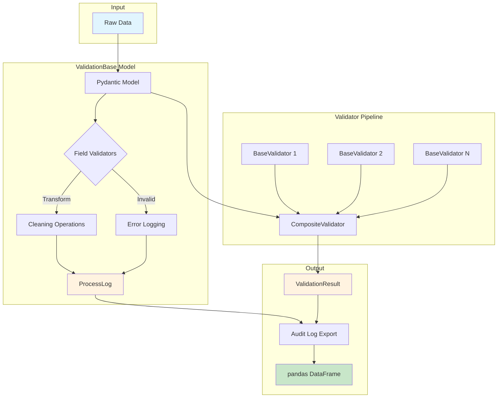
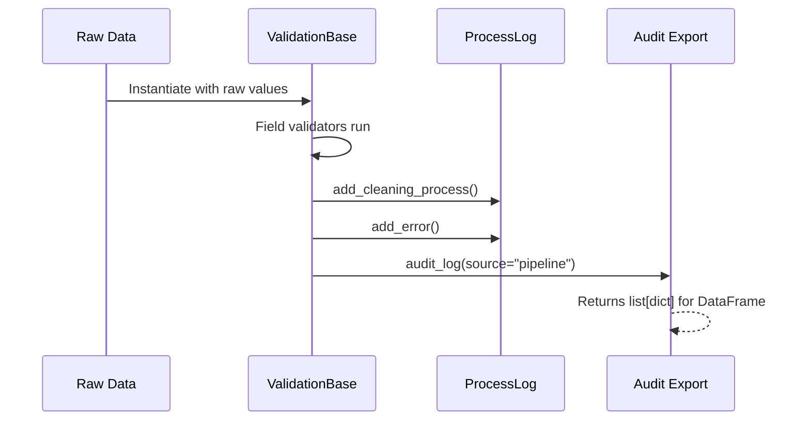
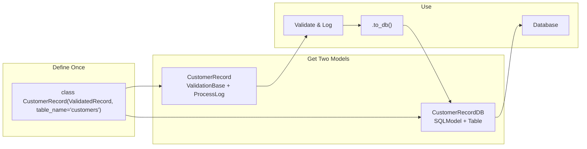
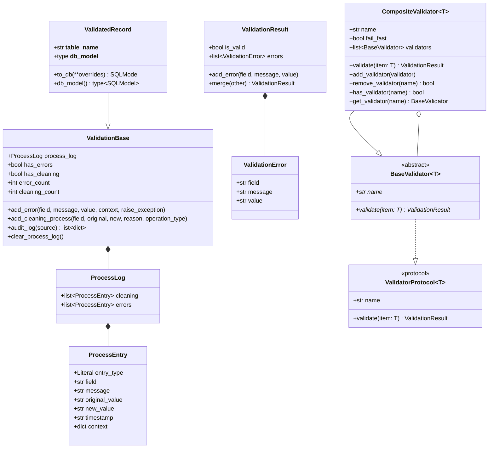

# abstract-validation-base

[](https://github.com/Abstract-Data/abstract-validation-base/actions/workflows/tests.yml)
[](https://github.com/Abstract-Data/abstract-validation-base/actions/workflows/lint.yml)
[](https://github.com/Abstract-Data/abstract-validation-base/actions/workflows/version-check.yml)
[](https://codecov.io/gh/Abstract-Data/abstract-validation-base)
[](https://mypy-lang.org/)
[](https://www.python.org/downloads/)

> **Production-ready validation and process tracking for data transformation pipelines.**

Build robust ETL pipelines with full audit trails, composable validators, and seamless Pydantic integration.

---

## Table of Contents

- [Why Abstract Validation Base?](#why-abstract-validation-base)
- [Architecture](#architecture)
- [Installation](#installation)
- [Quick Start](#quick-start)
- [Core Concepts](#core-concepts)
- [Complete Examples](#complete-examples)
  - [Data Cleaning Pipeline](#example-1-data-cleaning-pipeline)
  - [Multi-Validator Pipeline](#example-2-multi-validator-pipeline)
  - [Batch Processing with Audit Export](#example-3-batch-processing-with-audit-export)
- [SQLModel Integration](#sqlmodel-integration)
- [Class Diagram](#class-diagram)
- [API Reference](#api-reference)
- [Development](#development)
- [License](#license)

---

## Why Abstract Validation Base?

| Challenge | Solution |
|-----------|----------|
| **Silent data corruption** | Every cleaning operation and error is logged with timestamps |
| **Scattered validation logic** | Composable validators that can be combined into pipelines |
| **No audit trail** | Export complete process history to DataFrames for analysis |
| **Pydantic boilerplate** | Built-in process logging that works with your existing models |
| **Type safety gaps** | Full generic type support with `mypy` strict mode compatibility |

### Key Features

- **ValidationBase** — Pydantic base model with automatic process logging
- **ProcessLog** — Unified tracking for cleaning operations and errors
- **ValidationResult** — Generic result containers with error aggregation
- **BaseValidator** — Abstract base class for creating type-safe validators
- **CompositeValidator** — Combine multiple validators into validation pipelines
- **ValidatorProtocol** — Runtime-checkable protocol for dependency injection
- **ValidatedRecord** — SQLModel integration with auto-generated DB models

---

## Architecture



---

## Installation

```bash
pip install abstract-validation-base
```

Or with uv:

```bash
uv add abstract-validation-base
```

---

## Quick Start

### 1. Create a Model with Process Logging

```python
from abstract_validation_base import ValidationBase

class Contact(ValidationBase):
    name: str
    email: str
    phone: str | None = None

# Instantiate and track cleaning operations
contact = Contact(name="john doe", email="JOHN@EXAMPLE.COM", phone="555-1234")

# Log a cleaning operation
contact.add_cleaning_process(
    field="name",
    original_value="john doe",
    new_value="John Doe",
    reason="Title case normalization"
)

# Log an error (without raising)
contact.add_error(
    field="phone",
    message="Phone format not standardized",
    value="555-1234"
)

# Check status
print(f"Has errors: {contact.has_errors}")        # True
print(f"Has cleaning: {contact.has_cleaning}")    # True
print(f"Error count: {contact.error_count}")      # 1
print(f"Cleaning count: {contact.cleaning_count}")  # 1
```

### 2. Build a Validation Pipeline

```python
from abstract_validation_base import BaseValidator, CompositeValidator, ValidationResult

class EmailValidator(BaseValidator[Contact]):
    @property
    def name(self) -> str:
        return "email_validator"

    def validate(self, item: Contact) -> ValidationResult:
        result = ValidationResult(is_valid=True)
        if "@" not in item.email:
            result.add_error("email", "Invalid email format", item.email)
        return result

class PhoneValidator(BaseValidator[Contact]):
    @property
    def name(self) -> str:
        return "phone_validator"

    def validate(self, item: Contact) -> ValidationResult:
        result = ValidationResult(is_valid=True)
        if item.phone and not item.phone.replace("-", "").isdigit():
            result.add_error("phone", "Phone must contain only digits", item.phone)
        return result

# Combine into a pipeline
pipeline = CompositeValidator[Contact](
    validators=[EmailValidator(), PhoneValidator()],
    fail_fast=False  # Run all validators
)

result = pipeline.validate(contact)
print(f"Valid: {result.is_valid}")
for error in result.errors:
    print(f"  {error.field}: {error.message}")
```

---

## Core Concepts

### Cleaning vs Errors

| Concept | Purpose | Example |
|---------|---------|---------|
| **Cleaning** | Track data transformations | Trimming whitespace, normalizing case |
| **Errors** | Track validation failures | Missing required field, invalid format |

Both are stored in the `ProcessLog` and can be exported together for audit analysis.

### Process Logging Flow



### Validator Composition

The `CompositeValidator` allows you to:

- **Combine** multiple validators into a single pipeline
- **Control flow** with `fail_fast=True` to stop on first error
- **Dynamically manage** validators at runtime with `add_validator()` / `remove_validator()`

---

## Complete Examples

### Example 1: Data Cleaning Pipeline

A real-world example showing data cleaning with full audit trails:

```python
import re
from pydantic import field_validator
from abstract_validation_base import ValidationBase

class CustomerRecord(ValidationBase):
    """Customer record with automatic cleaning and audit logging."""
    
    first_name: str
    last_name: str
    email: str
    phone: str | None = None
    
    @field_validator("first_name", "last_name", mode="before")
    @classmethod
    def clean_name(cls, v: str) -> str:
        """Normalize name fields."""
        if not isinstance(v, str):
            return v
        return v.strip().title()
    
    @field_validator("email", mode="before")
    @classmethod
    def normalize_email(cls, v: str) -> str:
        """Lowercase and strip email."""
        if not isinstance(v, str):
            return v
        return v.strip().lower()
    
    @field_validator("phone", mode="before")
    @classmethod
    def normalize_phone(cls, v: str | None) -> str | None:
        """Extract digits only from phone."""
        if v is None:
            return None
        digits = re.sub(r"\D", "", v)
        return digits if digits else None

    def model_post_init(self, __context) -> None:
        """Log cleaning operations after model initialization."""
        # In practice, you'd compare against raw input values
        # This is a simplified example
        if self.first_name and self.first_name[0].isupper():
            self.add_cleaning_process(
                field="first_name",
                original_value="(raw input)",
                new_value=self.first_name,
                reason="Applied title case normalization"
            )


# Usage
record = CustomerRecord(
    first_name="  john  ",
    last_name="DOE",
    email="  JOHN.DOE@EXAMPLE.COM  ",
    phone="(555) 123-4567"
)

print(f"Name: {record.first_name} {record.last_name}")  # John Doe
print(f"Email: {record.email}")                          # john.doe@example.com
print(f"Phone: {record.phone}")                          # 5551234567

# Export audit log
import pandas as pd
audit_df = pd.DataFrame(record.audit_log(source="customer_import"))
print(audit_df[["entry_type", "field", "message", "timestamp"]])
```

### Example 2: Multi-Validator Pipeline

Building a comprehensive validation pipeline with multiple specialized validators:

```python
from dataclasses import dataclass
from abstract_validation_base import (
    BaseValidator,
    CompositeValidator,
    ValidationResult,
)

@dataclass
class Order:
    """Order data to validate."""
    order_id: str
    customer_email: str
    total: float
    items: list[str]


class RequiredFieldsValidator(BaseValidator[Order]):
    """Ensure all required fields are present."""
    
    @property
    def name(self) -> str:
        return "required_fields"
    
    def validate(self, item: Order) -> ValidationResult:
        result = ValidationResult(is_valid=True)
        
        if not item.order_id:
            result.add_error("order_id", "Order ID is required")
        if not item.customer_email:
            result.add_error("customer_email", "Customer email is required")
        if not item.items:
            result.add_error("items", "Order must have at least one item")
            
        return result


class FormatValidator(BaseValidator[Order]):
    """Validate field formats."""
    
    @property
    def name(self) -> str:
        return "format_validator"
    
    def validate(self, item: Order) -> ValidationResult:
        result = ValidationResult(is_valid=True)
        
        # Email format
        if item.customer_email and "@" not in item.customer_email:
            result.add_error(
                "customer_email",
                "Invalid email format",
                item.customer_email
            )
        
        # Order ID format (e.g., ORD-XXXXX)
        if item.order_id and not item.order_id.startswith("ORD-"):
            result.add_error(
                "order_id",
                "Order ID must start with 'ORD-'",
                item.order_id
            )
            
        return result


class BusinessRulesValidator(BaseValidator[Order]):
    """Validate business rules."""
    
    @property
    def name(self) -> str:
        return "business_rules"
    
    def validate(self, item: Order) -> ValidationResult:
        result = ValidationResult(is_valid=True)
        
        if item.total < 0:
            result.add_error("total", "Order total cannot be negative", str(item.total))
        
        if item.total > 10000:
            result.add_error(
                "total",
                "Order total exceeds maximum allowed ($10,000)",
                str(item.total)
            )
            
        return result


# Build the pipeline
pipeline = CompositeValidator[Order](
    validators=[
        RequiredFieldsValidator(),
        FormatValidator(),
        BusinessRulesValidator(),
    ],
    name="order_validation_pipeline",
    fail_fast=False,  # Collect all errors
)

# Validate an order
order = Order(
    order_id="12345",  # Missing ORD- prefix
    customer_email="invalid-email",
    total=-50.00,
    items=["Widget A"]
)

result = pipeline.validate(order)

print(f"Valid: {result.is_valid}")
print(f"Errors found: {len(result.errors)}")
for error in result.errors:
    print(f"  [{error.field}] {error.message}")

# Output:
# Valid: False
# Errors found: 3
#   [customer_email] Invalid email format
#   [order_id] Order ID must start with 'ORD-'
#   [total] Order total cannot be negative
```

### Example 3: Batch Processing with Audit Export

Processing multiple records and aggregating audit logs for analysis:

```python
from abstract_validation_base import (
    ValidationBase,
    BaseValidator,
    CompositeValidator,
    ValidationResult,
)
import pandas as pd

class VoterRecord(ValidationBase):
    """Voter record with cleaning and validation."""
    
    voter_id: str
    first_name: str
    last_name: str
    county: str
    registration_date: str


class CountyValidator(BaseValidator[VoterRecord]):
    """Validate county is in approved list."""
    
    VALID_COUNTIES = {"Travis", "Harris", "Dallas", "Bexar"}
    
    @property
    def name(self) -> str:
        return "county_validator"
    
    def validate(self, item: VoterRecord) -> ValidationResult:
        result = ValidationResult(is_valid=True)
        if item.county not in self.VALID_COUNTIES:
            result.add_error(
                "county",
                f"Unknown county: must be one of {self.VALID_COUNTIES}",
                item.county
            )
        return result


def process_voter_batch(raw_records: list[dict]) -> tuple[list[VoterRecord], pd.DataFrame]:
    """
    Process a batch of voter records with full audit logging.
    
    Returns:
        Tuple of (valid_records, audit_dataframe)
    """
    validator = CompositeValidator[VoterRecord](
        validators=[CountyValidator()],
        name="voter_pipeline"
    )
    
    valid_records: list[VoterRecord] = []
    all_audit_entries: list[dict] = []
    
    for i, raw in enumerate(raw_records):
        # Create record (triggers Pydantic validation)
        try:
            record = VoterRecord(**raw)
        except Exception as e:
            # Log parse failures
            all_audit_entries.append({
                "entry_type": "error",
                "field": "parse",
                "message": str(e),
                "source": f"record_{i}"
            })
            continue
        
        # Clean the name fields
        cleaned_first = raw.get("first_name", "").strip().title()
        if cleaned_first != raw.get("first_name"):
            record.add_cleaning_process(
                field="first_name",
                original_value=raw.get("first_name"),
                new_value=cleaned_first,
                reason="Normalized whitespace and case"
            )
        
        # Run validators
        result = validator.validate(record)
        
        if not result.is_valid:
            for error in result.errors:
                record.add_error(error.field, error.message, error.value)
        
        # Collect audit entries
        all_audit_entries.extend(record.audit_log(source=f"record_{i}"))
        
        if result.is_valid:
            valid_records.append(record)
    
    audit_df = pd.DataFrame(all_audit_entries)
    return valid_records, audit_df


# Example usage
raw_data = [
    {"voter_id": "V001", "first_name": "  john  ", "last_name": "Doe", 
     "county": "Travis", "registration_date": "2024-01-15"},
    {"voter_id": "V002", "first_name": "Jane", "last_name": "Smith", 
     "county": "InvalidCounty", "registration_date": "2024-02-20"},
    {"voter_id": "V003", "first_name": "Bob", "last_name": "Wilson", 
     "county": "Harris", "registration_date": "2024-03-10"},
]

valid_records, audit_df = process_voter_batch(raw_data)

print(f"Valid records: {len(valid_records)}/{len(raw_data)}")
print("\nAudit Summary:")
print(audit_df.groupby(["entry_type", "field"]).size())
```

---

## SQLModel Integration

`ValidatedRecord` provides seamless SQLModel integration - define your fields once and get both a validation model with full audit trails and an auto-generated SQLModel for database persistence.

### Basic Usage

```python
from sqlmodel import Session, create_engine
from abstract_validation_base import ValidatedRecord

# Define your model once with table_name
class CustomerRecord(ValidatedRecord, table_name="customers"):
    email: str
    name: str
    tier: str = "standard"

# Use ValidationBase features (process logging, error tracking)
customer = CustomerRecord(email="john@example.com", name="John", tier="premium")
customer.add_cleaning_process("name", "  john  ", "John", "Trimmed whitespace")
customer.add_error("email", "Domain not in allowlist", customer.email)

print(customer.has_errors)      # True
print(customer.audit_log())     # Full process log

# Convert to SQLModel for database persistence
db_customer = customer.to_db()
session.add(db_customer)
session.commit()

# Access the auto-generated SQLModel class for queries
CustomerDB = CustomerRecord.db_model()
customers = session.exec(select(CustomerDB)).all()
```

### How It Works



### Complete ETL Example

```python
from sqlmodel import SQLModel, Session, create_engine, select
from abstract_validation_base import (
    ValidatedRecord,
    BaseValidator,
    CompositeValidator,
    ValidationResult,
)
import pandas as pd


# Define validation model with auto-generated DB model
class VoterRecord(ValidatedRecord, table_name="voters"):
    voter_id: str
    first_name: str
    last_name: str
    county: str


# Create validators
class CountyValidator(BaseValidator[VoterRecord]):
    VALID_COUNTIES = {"Travis", "Harris", "Dallas", "Bexar"}
    
    @property
    def name(self) -> str:
        return "county_validator"
    
    def validate(self, item: VoterRecord) -> ValidationResult:
        result = ValidationResult(is_valid=True)
        if item.county not in self.VALID_COUNTIES:
            result.add_error("county", f"Invalid county", item.county)
        return result


# Build pipeline
pipeline = CompositeValidator[VoterRecord](
    validators=[CountyValidator()],
    name="voter_import"
)


def import_voters(raw_data: list[dict], session: Session):
    """Import voters with validation and audit logging."""
    valid_db_records = []
    audit_entries = []
    
    for raw in raw_data:
        # Create validation model
        record = VoterRecord(**raw)
        
        # Validate
        result = pipeline.validate(record)
        if not result.is_valid:
            for err in result.errors:
                record.add_error(err.field, err.message, err.value)
        
        # Collect audit log
        audit_entries.extend(record.audit_log(source=raw.get("voter_id")))
        
        # Convert valid records to DB models
        if result.is_valid:
            valid_db_records.append(record.to_db())
    
    # Bulk insert
    session.add_all(valid_db_records)
    session.commit()
    
    return valid_db_records, pd.DataFrame(audit_entries)


# Run the import
engine = create_engine("sqlite:///voters.db")
SQLModel.metadata.create_all(engine)

raw_data = [
    {"voter_id": "V001", "first_name": "John", "last_name": "Doe", "county": "Travis"},
    {"voter_id": "V002", "first_name": "Jane", "last_name": "Smith", "county": "Invalid"},
]

with Session(engine) as session:
    saved, audit_df = import_voters(raw_data, session)
    print(f"Saved: {len(saved)} records")
    print(audit_df)
```

### Key Benefits

| Feature | Description |
|---------|-------------|
| **Single Definition** | Define fields once, get validation + DB model |
| **Auto ID Field** | DB model automatically gets `id: int` primary key |
| **Full Audit Trail** | ProcessLog excluded from DB, available for export |
| **Lazy Generation** | DB model created on first access, not at import time |
| **Type Safe** | Full mypy support with generics |

---

## Class Diagram



---

## API Reference

### ValidationBase

A Pydantic base model with built-in process logging.

```python
from abstract_validation_base import ValidationBase

class MyModel(ValidationBase):
    field: str
```

| Method/Property | Description |
|-----------------|-------------|
| `has_errors` | `bool` — Check if any errors have been logged |
| `has_cleaning` | `bool` — Check if any cleaning operations have been logged |
| `error_count` | `int` — Get the number of logged errors |
| `cleaning_count` | `int` — Get the number of logged cleaning operations |
| `add_error(field, message, value?, context?, raise_exception?)` | Log an error; optionally raise exception |
| `add_cleaning_process(field, original, new, reason, operation_type?)` | Log a cleaning operation |
| `audit_log(source?)` | `list[dict]` — Export entries for DataFrame analysis |
| `clear_process_log()` | Clear all logged entries |

### ProcessEntry

Individual log entry for cleaning or error events.

```python
from abstract_validation_base import ProcessEntry

entry = ProcessEntry(
    entry_type="cleaning",  # or "error"
    field="name",
    message="Trimmed whitespace",
    original_value="  John  ",
    new_value="John",
    context={"operation_type": "normalization"}
)
```

### ValidationResult

Container for validation status and errors.

```python
from abstract_validation_base import ValidationResult

result = ValidationResult(is_valid=True)
result.add_error("field", "Error message", "bad_value")
print(result.is_valid)  # False
```

| Method | Description |
|--------|-------------|
| `add_error(field, message, value?)` | Add an error and set `is_valid=False` |
| `merge(other)` | Merge another result's errors into this one |

### BaseValidator

Abstract base class for creating validators.

```python
from abstract_validation_base import BaseValidator, ValidationResult

class MyValidator(BaseValidator[MyModel]):
    @property
    def name(self) -> str:
        return "my_validator"
    
    def validate(self, item: MyModel) -> ValidationResult:
        result = ValidationResult(is_valid=True)
        # validation logic here
        return result
```

### CompositeValidator

Combine multiple validators into a pipeline.

```python
from abstract_validation_base import CompositeValidator

pipeline = CompositeValidator[MyModel](
    validators=[ValidatorA(), ValidatorB()],
    name="my_pipeline",
    fail_fast=False
)
```

| Method/Property | Description |
|-----------------|-------------|
| `validate(item)` | Run all validators and combine results |
| `add_validator(validator)` | Add a validator to the composite |
| `remove_validator(name)` | Remove a validator by name; returns `bool` |
| `has_validator(name)` | Check if a validator exists; returns `bool` |
| `get_validator(name)` | Get a validator by name; returns `BaseValidator \| None` |
| `validators` | `list[BaseValidator]` — Copy of validators list |
| `validator_names` | `list[str]` — List of validator names |

### ValidatorProtocol

Runtime-checkable protocol for type hints and dependency injection.

```python
from abstract_validation_base import ValidatorProtocol

def run_validation(validator: ValidatorProtocol[MyModel], item: MyModel):
    return validator.validate(item)
```

### ValidatedRecord

Base class for SQLModel integration with auto-generated database models.

```python
from abstract_validation_base import ValidatedRecord

class UserRecord(ValidatedRecord, table_name="users"):
    email: str
    name: str
    age: int = 0

# Use validation features
user = UserRecord(email="test@example.com", name="Test", age=25)
user.add_error("email", "Domain not allowed", user.email)

# Convert to DB model
db_user = user.to_db()
db_user_with_id = user.to_db(id=123)  # Override fields

# Access the SQLModel class
UserDB = UserRecord.db_model()
```

| Method/Property | Description |
|-----------------|-------------|
| `to_db(**overrides)` | Convert to auto-generated SQLModel instance |
| `db_model()` | Get the auto-generated SQLModel class |
| `__table_name__` | The database table name |

---

## Development

```bash
# Clone the repository
git clone https://github.com/Abstract-Data/abstract-validation-base.git
cd abstract-validation-base

# Install dependencies
uv sync --dev

# Run tests
uv run pytest

# Run tests with coverage
uv run pytest --cov=src --cov-report=term-missing

# Run linters
uv run ruff check src tests
uv run mypy src
```

---

## License

MIT License
